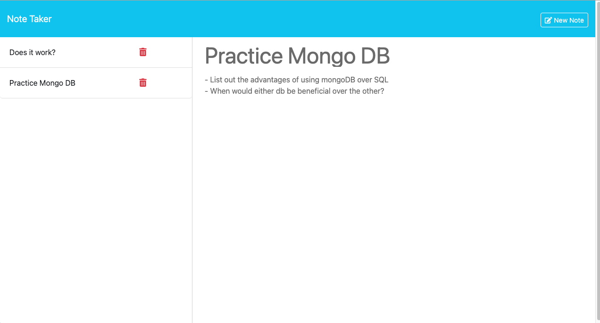
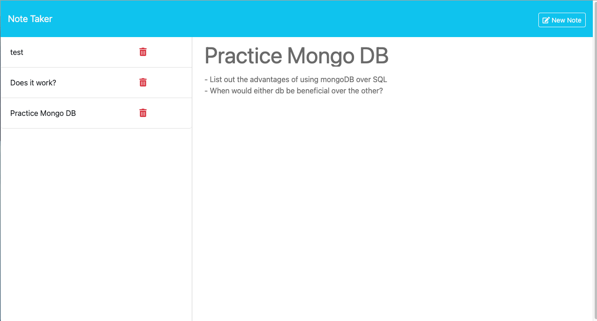

# Note Taker App
Link: https://note-taker-jacob-g-52d95e63d350.herokuapp.com/

## Description
As a busy student, I want to write and save notes so that I can organize my thoughts and keep track of my responsibilities. I decided that the perfect way to do this was to crerate a note taker app that will allow me to practice using node, express, and other libraries to create a usefull appm that will also allow me to practice my code writing abilities.

## Screen Shots

## Installation
Simply click on the link at the top of this readme and you will be redirected to the note taking app page!
    
## license
MIT 

Link: https://opensource.org/licenses/MIT

## Features
Save notes, Delete notes, Create new notes, View Saved notes
    